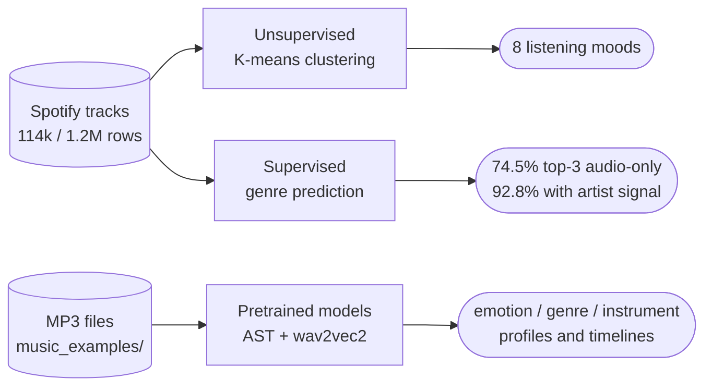
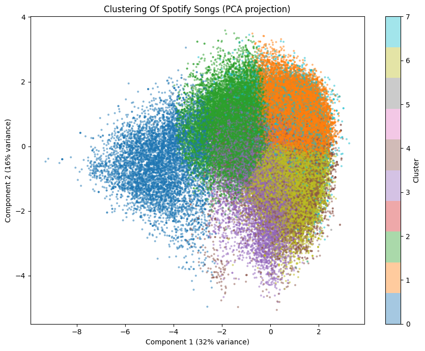
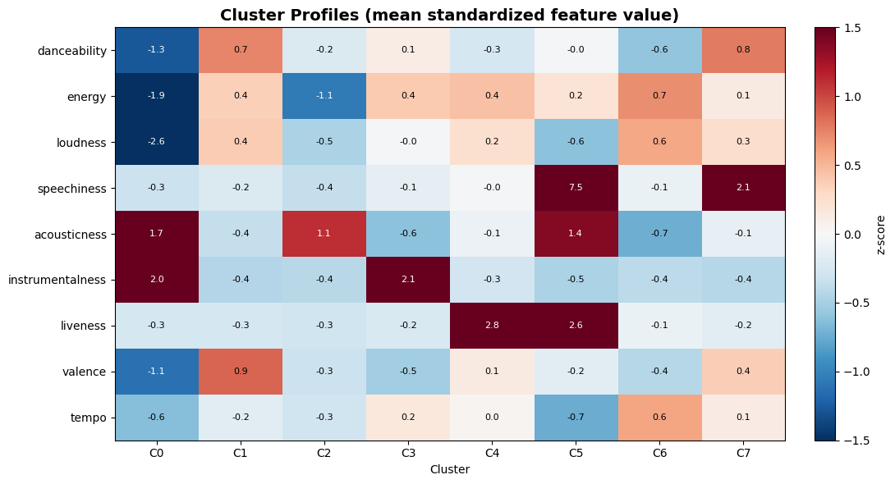
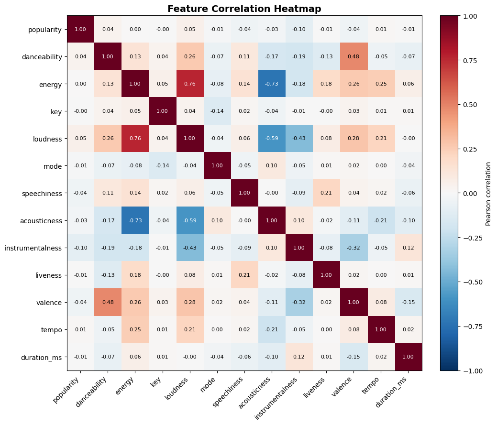
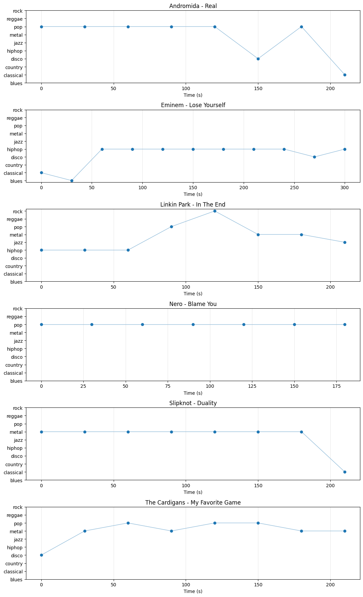
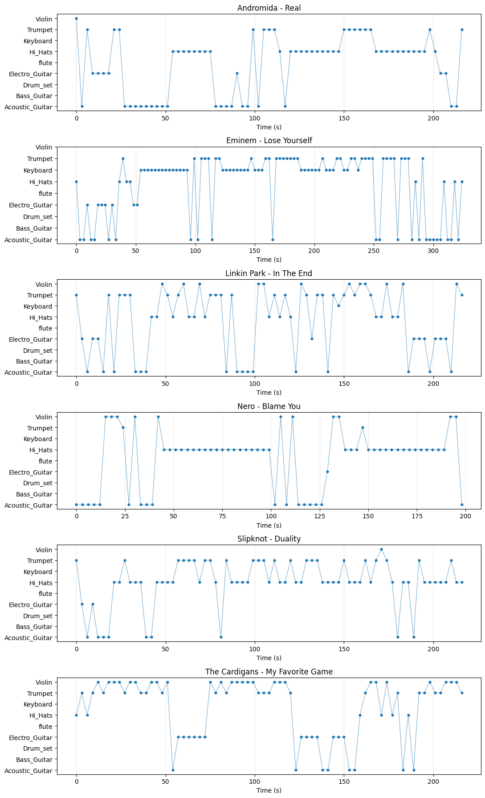
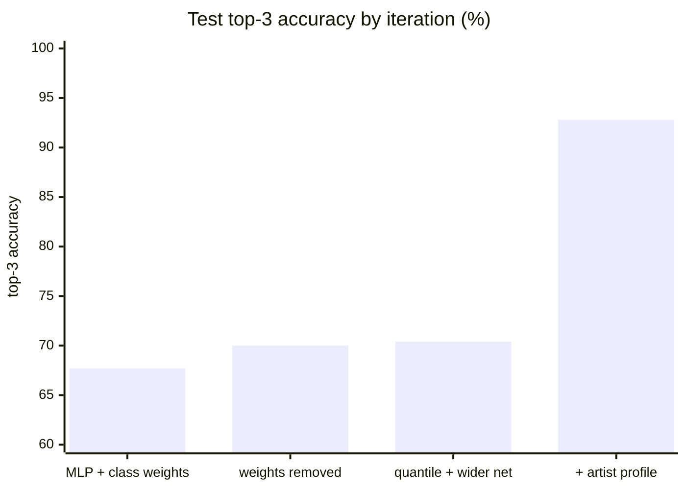
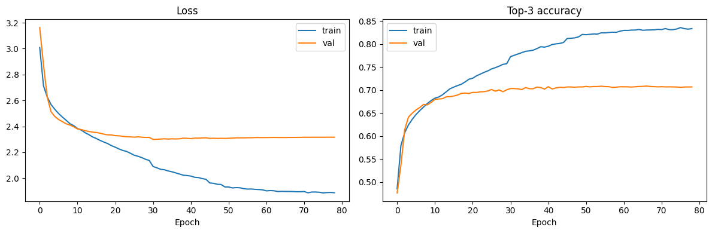

# Machine learning experiments in music


What can machine learning hear in music? This repo answers that three ways: by clustering 114k Spotify tracks into listening moods without any labels, by pointing pretrained audio transformers at real MP3s to read emotion, genre and instruments straight from the waveform, and by training a neural network that predicts a track's genre with 92.8% top-3 accuracy.



## Notebooks

| Notebook | Question | Approach | Result |
|---|---|---|---|
| [project0.ipynb](project0.ipynb) | What natural groups exist in 114k tracks? | K-means on 9 audio features, elbow + silhouette, PCA views | 8 interpretable clusters |
| [project1.ipynb](project1.ipynb) | Do the clusters hold at 1.2M tracks? | Same pipeline on the 10x dataset | clustering at 10x scale (no popularity column there) |
| [project-genre-nn.ipynb](project-genre-nn.ipynb) | Can we predict genre from the features? | Regularized MLP vs XGBoost, blended, plus artist target encoding | 74.5% top-3 from audio, 92.8% with artist |
| [project-music-by-emotion.ipynb](project-music-by-emotion.ipynb) | What emotion does a real song carry? | [Audio Spectrogram Transformer](https://huggingface.co/LaurenGurgiolo/Music_by_Emotion), 11 emotion classes | per-track emotion profile |
| [project-music-by-genre.ipynb](project-music-by-genre.ipynb) | What genre does a model hear over time? | [wav2vec2 fine-tuned on GTZAN](https://huggingface.co/sugarblock/music_genres_classification-finetuned-gtzan), 30 s windows | genre profile + timeline per song |
| [project-music-by-instrument.ipynb](project-music-by-instrument.ipynb) | Which instruments dominate each section? | [wav2vec2 instrument classifier](https://huggingface.co/Bhaveen/Musical-Instrument-Classification), 3 s windows | instrument profile + timeline |

The three inference notebooks share six test tracks (Andromida, Eminem, Linkin Park, Nero, Slipknot, The Cardigans) so the models' readings can be compared on the same songs.

## Part 1: clustering without labels

[project0.ipynb](project0.ipynb) asks what structure the audio features carry on their own. Nine features (danceability, energy, loudness, speechiness, acousticness, instrumentalness, liveness, valence, tempo) are standardized and fed to K-means; the elbow curve and a silhouette score of 0.20 point to k=8, fuzzy borders included.

The clusters come out genuinely listenable. Each one has a recognizable personality, down to the genres that dominate it:

| Cluster | Tracks | Sound | Top genres |
|---|---|---|---|
| 0 | 7,366 | quiet instrumental | new-age, sleep, classical |
| 1 | 32,835 | happy and danceable | salsa, latino, reggaeton |
| 2 | 22,274 | soft acoustic ballads | romance, honky-tonk, tango |
| 3 | 11,566 | instrumental electronic | minimal-techno, detroit-techno, techno |
| 4 | 7,431 | live, high energy | pagode, sertanejo, samba |
| 5 | 942 | spoken word | comedy, kids, show-tunes |
| 6 | 24,572 | loud and fast | metalcore, heavy-metal, grunge |
| 7 | 7,013 | rhythmic vocal | j-dance, dancehall, funk |

<p align="center">
  
  
</p>

The feature correlation heatmap that drove feature selection (key and mode correlate with nothing and were dropped):

<p align="center">
  
</p>

[project1.ipynb](project1.ipynb) re-runs the pipeline on the 1.2M-track dataset to check the structure is not an artifact of the smaller sample.

## Part 2: pretrained models on real songs

The three `project-music-by-*` notebooks skip training and ask what off-the-shelf audio transformers hear in six real MP3s, Slipknot and Eminem next to The Cardigans. Full songs get chopped into windows (30 s for genre, 3 s for instruments), every window is classified, and the softmax probabilities average into a per-track profile. The per-window top picks become a timeline of how the model's call moves through a song.

What the three models heard, top pick and mean probability per track:

| Track | Emotion | Genre | Instrument |
|---|---|---|---|
| Andromida - Real | Bad (46%) | pop (64%) | hi-hats (18%) |
| Eminem - Lose Yourself | Sleepy (39%) | hiphop (70%) | trumpet (17%) |
| Linkin Park - In The End | Disgust (41%) | hiphop (43%) | acoustic guitar (18%) |
| Nero - Blame You | Sad (55%) | pop (97%) | hi-hats (18%) |
| Slipknot - Duality | Bad (42%) | metal (86%) | hi-hats (21%) |
| The Cardigans - My Favorite Game | Bad (80%) | pop (37%) | violin (18%) |

The genre model earns its keep. Duality is metal at 86%, top pick in 88% of its windows. Lose Yourself is hiphop, and In The End splits between hiphop, pop and rock, a fair reading of a rap-rock song. Then there is Nero: 97% pop, the most confident call on the whole table, for a drum and bass track. GTZAN has ten genres and none of them is dubstep; a model forced to choose will choose with conviction. Closed vocabularies fail silently.

The timelines are better than the headline numbers, because they line up with song structure:

<p align="center">
  
</p>

The model hears Lose Yourself's quiet piano intro as classical, drifts through blues, then locks onto hiphop for the remaining five minutes. In The End starts as hiphop through the rapped verses and climbs to rock and metal as the guitars take over. Duality is a flat metal line until the quiet outro, which reads as classical. None of that was prompted; it falls out of classifying 30-second windows independently.

The other two models fare worse, in instructive ways. The emotion model calls three of six tracks "Bad" and thinks Lose Yourself is "Sleepy". The instrument model never gets above 21% confidence and hears hi-hats first in half of everything:

<p align="center">
  
</p>

That model was trained on isolated single-instrument clips, and a full band mix is a different beast. The trumpet it hears in Lose Yourself and the violin in My Favorite Game are confusions a human would not make. The lesson the section keeps teaching: a model used outside its training distribution gives you a sketch, not ground truth, and the confidence number tells you which one you are holding.

## Part 3: predicting genre

[project-genre-nn.ipynb](project-genre-nn.ipynb) is the deepest notebook, built on the workflow from [Leonhardt's Medium article](https://medium.com/@juanfraleonhardt/music-genre-classification-a-machine-learning-exercise-9c83108fd2bb): clean the data, drop country-name genres, merge 103 raw genres into 56 groups that sound alike (Ward clustering on genre centroids), then train. The article's best results were 73.7% top-3 for XGBoost and 69.5% for its neural network.

Four measured iterations, same 12,227-track test split throughout:



| Iteration | NN | XGBoost | Blend |
|---|---|---|---|
| Regularized MLP, balanced class weights | 67.7% | 73.6% | 74.4% |
| Class weights removed | 70.0% | | |
| Quantile-transformed inputs, wider funnel | 70.4% | 73.7% | 74.5% |
| Artist profile features added | 92.6% | 89.9% | **92.8%** |

<p align="center">
  
</p>

What the iterations taught, in order of impact:

1. Artist target encoding was worth +22 points, more than every modeling decision combined. Each lead artist becomes their smoothed training-set genre distribution; 90% of test tracks have a known artist, and artists rarely span genre groups. When a model plateaus, the answer is usually a feature you are not using, not a layer you have not stacked.
2. Removing balanced class weights gained +2.3 points. They optimize per-class recall while the metric is overall accuracy; the training objective has to match what you measure.
3. Blending the NN with XGBoost beat both single models in every round. The mixing weight tells its own story: 0.30 NN on audio-only features (trees win on tables) but 0.95 NN once the smooth artist distribution arrived (networks exploit probability inputs better than axis-aligned splits).
4. Quantile-transforming inputs and doubling the width moved +0.4 combined. Defensible per [Gorishniy et al.](https://arxiv.org/abs/2106.11959), but the audio features simply top out near 71% for this network.

The two headline numbers answer different questions. Audio features alone reach 74.5% top-3, and the confusion analysis shows the rest is genuine genre overlap (alt-rock vs grunge, dance vs latin). Adding who made the track reaches 92.8%, largely because in this dataset genre is an artist property. Quote whichever number matches the question being asked.

## Data

| File | Contents |
|---|---|
| [spotify-tracks-dataset/spotify_tracks_dataset_114k.csv](spotify-tracks-dataset/) | 114,000 tracks, 20 columns, 114 genre labels, with Spotify audio features and popularity |
| [spotify-tracks-dataset/spotify_tracks_dataset_1_2m.tar.xz](spotify-tracks-dataset/) | 1.2M-track variant, same features, no popularity column |

The 114k file is the widely shared [Spotify tracks dataset](https://huggingface.co/datasets/maharshipandya/spotify-tracks-dataset). Feature definitions (danceability, valence, etc.) are documented in each notebook's column-description cell.

## Running the notebooks

Everything targets Google Colab; the libraries used (TensorFlow, scikit-learn, XGBoost, librosa, transformers) ship with it or install in the first cell. The notebooks expect these paths in Google Drive:

```
My Drive/google_colab/spotify_tracks_dataset_114k.csv      <- part 1 and 3
My Drive/google_colab/spotify_tracks_dataset_1_2m.csv      <- project1
My Drive/google_colab/music_examples/*.mp3                 <- part 2 (any six songs work)
```

A GPU runtime (Runtime > Change runtime type) cuts the genre-nn training from about ten minutes to two.

## Project log

| Date | What happened |
|---|---|
| Jun 8 | First clustering of the 114k dataset; cluster profiles and per-cluster top tracks ([`f3be569`](https://github.com/4matic/machine-learning-experiments-in-music/commit/f3be569)...[`25100c7`](https://github.com/4matic/machine-learning-experiments-in-music/commit/25100c7)) |
| Jun 9 | Collected reference material ([links.txt](links.txt)); scaled clustering to the 1.2M dataset ([`3d57b81`](https://github.com/4matic/machine-learning-experiments-in-music/commit/3d57b81)) |
| Jun 10 | Added the three pretrained-model inference notebooks ([`8ef2974`](https://github.com/4matic/machine-learning-experiments-in-music/commit/8ef2974)) |
| Jun 11 | Documented the clustering notebook; moved inference to six shared test tracks; built the supervised genre notebook ([`7d867c4`](https://github.com/4matic/machine-learning-experiments-in-music/commit/7d867c4)...[`974061a`](https://github.com/4matic/machine-learning-experiments-in-music/commit/974061a)) |
| Jun 12 | Tuning rounds, artist features, analysis graphs and the final report ([`4b73fe4`](https://github.com/4matic/machine-learning-experiments-in-music/commit/4b73fe4), [`fdd70c1`](https://github.com/4matic/machine-learning-experiments-in-music/commit/fdd70c1)) |

## References

Starting points

- J. F. Leonhardt, [Music Genre Classification: a Machine Learning exercise](https://medium.com/@juanfraleonhardt/music-genre-classification-a-machine-learning-exercise-9c83108fd2bb) (Medium) - the workflow project-genre-nn follows
- [K-Means Spotify Song Clustering](https://www.kaggle.com/code/sivarazadi/k-means-spotify-song-clustering) and [Music Genre Classification](https://www.kaggle.com/code/jvedarutvija/music-genre-classification) (Kaggle)
- [Genre classification with the Spotify API](https://github.com/aggittle/Genre-Classification-with-Spotify-API/blob/master/Spotify%20Classification.ipynb) (GitHub)

Pretrained models

- [LaurenGurgiolo/Music_by_Emotion](https://huggingface.co/LaurenGurgiolo/Music_by_Emotion) - AST, 11 emotions
- [sugarblock/music_genres_classification-finetuned-gtzan](https://huggingface.co/sugarblock/music_genres_classification-finetuned-gtzan) - wav2vec2, 10 GTZAN genres
- [Bhaveen/Musical-Instrument-Classification](https://huggingface.co/Bhaveen/Musical-Instrument-Classification) - wav2vec2, 9 instruments

Papers behind the modeling choices

- Grinsztajn, Oyallon, Varoquaux, [Why do tree-based models still outperform deep learning on tabular data?](https://arxiv.org/abs/2207.08815) (NeurIPS 2022)
- Kadra et al., [Well-tuned Simple Nets Excel on Tabular Datasets](https://arxiv.org/abs/2106.11189) (NeurIPS 2021)
- Gorishniy et al., [Revisiting Deep Learning Models for Tabular Data](https://arxiv.org/abs/2106.11959) (NeurIPS 2021)
